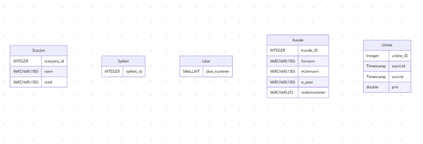
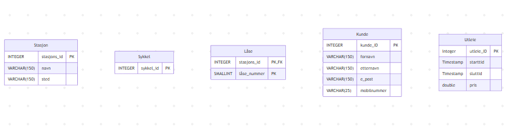
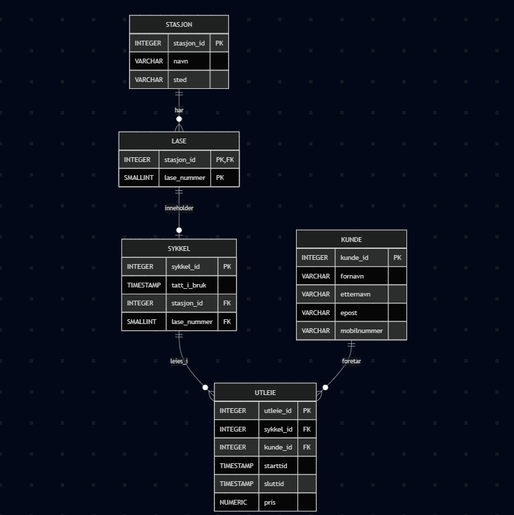

# Besvarelse - Refleksjon og Analyse

**Student:** [Harun Hari Handule]

**Studentnummer:** [hahan6932]

**Dato:** [Innleveringsdato]

---

## Del 1: Datamodellering

### Oppgave 1.1: Entiteter og attributter

**Identifiserte entiteter:**

Sykkel
En sykkel er atskilt fra en sykkelstasjon, de har et forhold, men den eksisterer uten den, og den har sine egne egenskaper atskilt fra en sykkelstasjon.

sykkel_stasjon-Jeg lagde en sykkelstasjonstabell fordi oppgaven forklarte at sykkelsystemet har forskjellige sykkelstasjoner, noe som betyr at alle har forskjellige plasseringer, noe som er en egenskap, og sykler er avhengige av den individuelle stasjonen som skal leies av kunder som trenger en stasjonstabell.

Kunde-Kunder er en viktig del av systemet. De kan eksistere uten sykkelen og har sine egne egenskaper, samtidig som de har forbindelser til andre tabeller, som for eksempel sykkelen.

utleie-En utleiesykkel er en egen tabell fordi den representerer én tur mellom en kunde og en sykkel. Den lagrer informasjon om den spesifikke turen, som starttid, sluttid og pris. Disse verdiene tilhører ikke bare sykkelen eller kunden – de tilhører den turen. En kunde kan leie mange sykler over tid, og en sykkel kan leies mange ganger av forskjellige kunder. På grunn av det trenger vi en egen utleietabell for å lagre hver utleiesykkel separat.

**Attributter for hver entitet:**

Stasjon
stasjons-ID 
navn
sted


Forklaring:Systemet må holde oversikt over hvor sykler befinner seg. En stasjon representerer et fysisk sted hvor sykler kan parkeres og hentes. Hver stasjon har sin egen ID, navn og plassering. Siden mange sykler kan være på samme stasjon, og sykler flyttes mellom stasjoner over tid, må stasjonen lagres som en separat enhet.

Sykkel
sykkel_id


Forklaring:Hver sykkel må identifiseres individuelt og ha en unik ID. En sykkel kan flyttes mellom stasjoner og kan leies mange ganger over tid.

Låse
låse_nummer

Forklaring:En lås representerer et fysisk låsepunkt på en stasjon. Hver stasjon har flere låser, og hver lås identifiseres med et nummer som er unikt innenfor stasjonen. Så den eneste måten å identifisere den på er med sin egen tabell med flere låserader som tilhører forskjellige stasjoner. Derfor må du modellere låser som en separat enhet med en relasjon til stasjonen.

Kunde
kunde-ID 
mobilnummer
e-post
fornavn
etternavn

Forklaring:Systemet må lagre informasjon om hver kunde slik at de kan leie sykler og bli belastet riktig. Hver kunde har en unik ID og kontaktinformasjon. Dette gjør det mulig å identifisere hvem som leier en sykkel og å håndtere betalinger og bekreftelser.

Utleie
utleie-ID
starttid 
sluttid 
pris

Forklaring:En leiebil representerer én spesifikk sykkeltur. Den lagrer informasjon om når turen startet, når den sluttet og sluttprisen. Denne informasjonen tilhører selve turen, ikke sykkelen eller kunden. Siden både sykler og kunder kan være involvert i mange utleieavtaler over tid, må hver utleieavtale lagres separat.


---

### Oppgave 1.2: Datatyper og `CHECK`-constraints

**Valgte datatyper og begrunnelser:**

Stasjon
stasjons-ID INTEGER
navn VARCHAR(150)
sted VARCHAR(150)


Forklaring:Stasjons-ID lagres som INTEGER fordi det er en enkel og effektiv måte å identifisere hver stasjon unikt og effektivt i databasen. Navn og plassering lagres som VARCHAR fordi de inneholder tekst av varierende lengde.

Sykkel
sykkel_id INTEGER


Forklaring:Bike_id lagres som INTEGER for å identifisere hver sykkel unikt. Ingen andre attributter er nødvendige for selve sykkelen i denne modellen.

Låse
låse_nummer smallint NOT NULL

Forklaring:Låsnummeret lagres som SMALLINT fordi hver stasjon har et begrenset antall låser

Kunde
kunde-ID INTEGER
mobilnummer VARCHAR(25)
e-post      VARCHAR(150)
fornavn     VARCHAR(150)
etternavn   VARCHAR(150)

Forklaring:Kunde-ID lagret som HELTAL er et heltall fordi det kan identifisere hver kunde unikt. Fornavn, etternavn og e-post lagres som VARCHAR fordi de inneholder tekst av varierende lengde. Mobilnummer lagres også som VARCHAR fordi telefonnumre er identifikatorer, ikke tall som brukes til beregning, og kan inneholde innledende nuller eller landskoder.


Utleie
utleie-ID INTEGER
starttid Tidsstempel
sluttid  Tidsstempel
pris     Double

Forklaring:Utleie-ID lagres som INTEGER fordi det er et heltall som enkelt kan identifisere hver utleie unikt og effektivt. Starttidspunkt og sluttidspunkt lagres som TIDSTEMPEL fordi både dato og klokkeslett må registreres. Prisen lagres som HELTALL for å representere det endelige beløpet. Siden systemet bare trenger å lagre sluttbeløpet og ikke utføre komplekse valutaberegninger, er et heltall tilstrekkelig.


**`CHECK`-constraints:**

Stasjon
stasjons-ID NOT NULL
navn VARCHAR(150) NOT NULL
sted VARCHAR(150) NOT NULL


Forklaring:En stasjon må ha en ID, et navn og en plassering for å eksistere i systemet. Derfor er alle disse feltene satt til IKKE NULL. Hvis noe av denne informasjonen manglet, ville ikke stasjonen være brukbar fordi systemet ikke ville vite hva den heter eller hvor den befinner seg. Disse begrensningene sørger for at bare komplette og gyldige stasjoner kan lagres i databasen.

Sykkel
sykkel_id NOT NULL


Forklaring:Bike_id lagres som INTEGER for å identifisere hver sykkel unikt. Ingen andre attributter er nødvendige for selve sykkelen i denne modellen.

Låse
låse_nummer smallint NOT NULL

Forklaring:Låsnummeret kan ikke være null fordi en lås ikke endres over tid innenfor en stasjon.


Kunde
kunde-ID NOT NULL
mobilnummer VARCHAR(25) NOT NULL
e-post      VARCHAR(150) NOT NULL
fornavn     VARCHAR(150) NOT NULL
etternavn   VARCHAR(150) NOT NULL

Forklaring:En kunde må oppgi mobilnummer, e-post, fornavn og etternavn ved registrering. Derfor er alle disse feltene satt til IKKE NULL. Hvis noe av denne informasjonen manglet, kunne ikke kunden registrere seg ordentlig, motta bekreftelser eller bli belastet for utleie. Disse begrensningene sikrer at bare fullt registrerte kunder finnes i systemet, og at betalinger og kommunikasjon kan fungere som de skal.


Utleie
utleie-ID NOT NULL
starttid Tidsstempel NOT NULL
sluttid  Tidsstempel NULL
pris     Double NULL

Forklaring:En leieperiode må alltid ha en starttid, fordi systemet må vite når sykkelen ble låst opp. Derfor er starttid IKKE NULL. Sluttid og pris kan være NULL fordi de ikke er kjent ved starten av leieperioden. Så lenge sykkelen fortsatt er i bruk, er det ingen returtid og ingen endelig pris ennå. Når sykkelen returneres, fylles disse verdiene ut. Dette oppsettet lar systemet håndtere både aktive og fullførte leieperioder på en naturlig måte.


**ER-diagram:**

[Legg inn mermaid-kode eller eventuelt en bildefil fra `mermaid.live` her]

--- ! !!

### Oppgave 1.3: Primærnøkler

**Valgte primærnøkler og begrunnelser:**

[
Stasjon
stasjons-ID (PK)
navn VARCHAR(150) NOT NULL
sted VARCHAR(150) NOT NULL

Forklaring: station_id er primærnøkkelen fordi hver stasjon må være unik i systemet. Stasjoner kan ha samme navn eller lignende plasseringer, så disse attributtene kan ikke garantere unikhet. En separat identifikator sikrer at hver stasjon kan refereres til uten tvetydighet, spesielt når sykler er tilordnet stasjoner.

Sykkel
sykkel_id NOT NULL


Forklaring:sykkel_id er primærnøkkelen fordi hver fysiske sykkel må spores. Sykler flyttes mellom stasjoner og er involvert i flere leieperioder over tid. Systemet må kunne skille en sykkel fra en annen til enhver tid.

Låse
stasjons-ID (PK,FK)
låse_nummer smallint NOT NULL PK

Forklaring:En lås identifiseres ikke bare av låsenummeret, fordi det samme nummeret kan finnes på flere stasjoner. 
Låsenummeret er bare unikt innenfor en bestemt stasjon, ikke på tvers av hele systemet. 
Derfor må både stasjons-ID og låsenummer brukes sammen som en primærnøkkel.
Kombinasjon av disse sikrer at hver lås er unikt identifisert, samtidig som det tillater at forskjellige stasjoner har låser med samme nummer. 
Stasjons-ID fungerer også som en fremmednøkkel fordi en lås alltid tilhører én bestemt stasjon og ikke kan eksistere uten den.

Kunde
kunde-ID NOT NULL
mobilnummer VARCHAR(25) NOT NULL
e-post      VARCHAR(150) NOT NULL
fornavn     VARCHAR(150) NOT NULL
etternavn   VARCHAR(150) NOT NULL

Foklaring: customer_id er primærnøkkelen fordi hver registrerte bruker må kunne identifiseres. Selv om e-postadresse og mobilnummer potensielt kan være unike, kan de endres over tid. En separat kunde-ID sikrer stabil identifikasjon selv om kontaktinformasjonen oppdateres. Dette gjør at utleie og betalinger alltid refererer til riktig person.

Utleie
utleie-ID NOT NULL
starttid Tidsstempel NOT NULL
sluttid  Tidsstempel NULL
pris     Double NULL

Forklaring: rental_id er primærnøkkelen fordi hver utleie representerer en unik transaksjon. En kunde kan leie flere sykler over tid, og en sykkel kan leies mange ganger. Kombinasjonen av sykkel og kunde vil ikke være unik over tid. Derfor er en separat utleie-ID nødvendig for å identifisere hver utleieforekomst og lagre starttidspunkt, sluttidspunkt og sluttbeløp.

]


**Naturlige vs. surrogatnøkler:**

[
Surrogatprimærnøklene i modellen er stasjons_id i Stasjon, sykkel_id i Sykkel, kunde_id i Kunde og utleie_id i Utleie. 
Dette er systemgenererte identifikatorer uten reell betydning, og de brukes til å identifisere hver post. 
De endres ikke over tid og lar andre tabeller referere til poster.

For kundeenheten kan e_post og mobilnummer fungere som naturlige nøkler fordi de er reelle attributter som identifiserer en person utenfor systemet. 
De er unike kontaktdetaljer knyttet direkte til kunden og kan brukes til å bekrefte identitet om nødvendig. 
Hvis surrogatkunde_id av en eller annen grunn skulle feile, kan e-postadressen eller telefonnummeret fortsatt identifisere kunden unikt.
Av denne grunn er de sterke naturlige nøkkelkandidater.
]

**Oppdatert ER-diagram:**

[Legg inn mermaid-kode eller eventuelt en bildefil fra `mermaid.live` her]

---!!

### Oppgave 1.4: Forhold og fremmednøkler

**Identifiserte forhold og kardinalitet:**

[Skriv ditt svar her - list opp alle forholdene mellom entitetene og angi kardinalitet:

I dette systemet har forholdet mellom stasjon og lås en én-til-mange-kardinalitet.

En stasjon kan ha mange låser, men hver lås kan bare låse én stasjon. En lås identifiseres av låsnummeret, siden låsnummer kan være unikt innenfor en enkelt stasjon.

Forholdet mellom lås og sykkel er én-til-mange (med den mulige tomme låsen).

En lås kan inneholde maksimalt én sykkel, mens en sykkel kan være plassert i én spesifikk lås på en stasjon, eller ikke være plassert i noen lås hvis den er leid. Dette betyr at sykkelen refererer til både stasjons-ID og låsnummer for å indikere sin nåværende plassering.

Forholdet mellom sykkel og utleie er én-til-mange.

En sykkel kan vises i mange utleieposter, men hver utleie er for én sykkel.

Forholdet mellom kunde og utleie er også én-til-mange.

En kunde kan ha mange utleieobjekter over tid, men hver utleieobjekt tilhører nøyaktig én kunde.

Det er ingen direkte sammenheng mellom stasjon og utleie eller mellom kunde og sykkel, siden utleie fungerer som den sammenkoblede enheten mellom kunder og sykler.
]

**Fremmednøkler:**

[Skriv ditt svar her - list opp alle fremmednøklene og forklar hvordan de implementerer forholdene
station_ID i Lock er en fremmednøkkel som refererer til Station. Den implementerer en-til-mange-forholdet mellom stasjon og lås, og sikrer at en lås ikke kan eksistere uten en gyldig stasjon.

Kombinasjonen av station_ID og lock_number i Lock fungerer som primærnøkkel og identifiserer hver lås unikt innenfor en stasjon.

station_ID og lock_number i Bike er fremmednøkler som refererer til Lock. Dette implementerer forholdet mellom sykkel og lås, og sikrer at en sykkel kan plasseres i en eksisterende lås på en eksisterende stasjon.

I Rental er bike_ID en fremmednøkkel som refererer til Bike, og customer_ID er en fremmednøkkel som refererer til Customer. Disse implementerer to separate en-til-mange-forhold: én sykkel kan forekomme hos mange leietakere over tid, og én kunde kan oppleve mange leietakere over tid. Hver leieoppføring refererer imidlertid til nøyaktig én sykkel og én kunde.
]

**Oppdatert ER-diagram:**

[Legg inn mermaid-kode eller eventuelt en bildefil fra `mermaid.live` her]

---!

### Oppgave 1.5: Normalisering

**Vurdering av 1. normalform (1NF):**

[Skriv ditt svar her - forklar om datamodellen din tilfredsstiller 1NF og hvorfor:
        
Datamodellen følger 1NF fordi alle tabeller har en primærnøkkel, og alle kolonner inneholder atomverdier.
Det er ingen gjentakende grupper eller lister i en enkelt kolonne. 
For eksempel lagres ett mobilnummer og én e-postadresse per kunde, og én starttid og sluttid per utleie. 
Hver rad representerer én enhet, og alle felt inneholder én enkelt verdi.

]

**Vurdering av 2. normalform (2NF):**

[Skriv ditt svar her - forklar om datamodellen din tilfredsstiller 2NF og hvorfor:

Alle tabellene i modellen følger andre normalform (2NF). 
2NF krever at alle ikke-nøkkelattributter i en tabell avhenger av hele primærnøkkelen, og ikke bare deler av den. 
I tabellene Stasjon, Sykkel, Kunde og Utleie bruker hver tabell en primærnøkkel med én kolonne. Fordi primærnøkkelen bare består av ett attributt, er det umulig å ha en delvis avhengighet.
Derfor avhenger alle ikke-nøkkelattributter i disse tabellene automatisk fullt ut av sine respektive primærnøkler, og kravet til 2NF er oppfylt.


Låsetabellen bruker en sammensatt primærnøkkel som består av (stasjons-id, låsenummer). 
I denne utformingen inneholder tabellen ingen ekstra ikke-nøkkelattributter – bare attributtene som danner selve primærnøkkelen. 
Siden 2NF bare gjelder ikke-nøkkelattributter, og det ikke finnes noen i denne tabellen, kan det ikke være noen delvis avhengighet. 
Som et resultat tilfredsstiller også Låsetabellen 2NF.
]

**Vurdering av 3. normalform (3NF):**

[Skriv ditt svar her - forklar om datamodellen din tilfredsstiller 3NF og hvorfor:

Datamodellen følger 3NF fordi det ikke finnes transitive avhengigheter.
Ingen ikke-nøkkelattributter er avhengige av andre ikke-nøkkelattributter. 
For eksempel, i kundetabellen er fornavn, etternavn, mobilnummer og e-post direkte avhengig av kunde-id, og ikke av hverandre.
E-post og mobilnummer er satt som unike (naturlige kandidater), men de er fortsatt avhengige av primærnøkkelen, kun ment som en sikkerhetsforanstaltning for å styrke kunden ytterligere i tilfelle primærnøkkelen feiler.
Derfor bryter de ikke 3NF, og i låsetabellen hvis jeg bare hadde gjort låsnummeret til primærnøkkel, ville det være delvis, siden låsen er avhengig av stasjonens plassering og låsen i den stasjonen.

]

**Eventuelle justeringer:**

[Skriv ditt svar her - hvis modellen ikke var på 3NF, forklar hvilke justeringer du har gjort:

Selv om ikke-nøkkelattributter senere ble lagt til i Lock-tabellen (for eksempel et statusfelt), ville de avhenge av den fullstendige kombinasjonen av station_id og lock_number,
fordi en lås bare identifiseres unikt av begge verdiene sammen. 
Og kundens naturlige nøkler, e-postadresser og telefonnumre, fungerer bare som en måte å holde kundeinformasjonen tryggere på, men alle attributter er fortsatt avhengige av kunde-ID.

]

---

## Del 2: Database-implementering

### Oppgave 2.1: SQL-skript for database-initialisering

**Plassering av SQL-skript:**

[Bekreft at du har lagt SQL-skriptet i `init-scripts/01-init-database.sql`]

**Antall testdata:**

- Kunder: [antall:5]
- Sykler: [antall:100]
- Sykkelstasjoner: [antalll:5]
- Låser: [antall:100]
- Utleier: [antall:50]

---

### Oppgave 2.2: Kjøre initialiseringsskriptet

**Dokumentasjon av vellykket kjøring:**

[Skriv ditt svar her - f.eks. skjermbilder eller output fra terminalen
som viser at databasen ble opprettet uten feil:
running /docker-entrypoint-initdb.d/init.sql

CREATE DATABASE
You are now connected to database "sykkel_system" as user "postgres".

CREATE TABLE
CREATE TABLE
CREATE TABLE
CREATE TABLE
CREATE TABLE

INSERT 0 5
INSERT 0 100
INSERT 0 100
INSERT 0 5
INSERT 0 50

CREATE ROLE
GRANT
GRANT
CREATE ROLE
GRANT
REVOKE
CREATE ROLE
GRANT

CREATE INDEX
CREATE INDEX
CREATE INDEX

        status
-------------------------
Database initialisert!
(1 row)
]

**Spørring mot systemkatalogen:**

```sql
SELECT table_name 
FROM information_schema.tables 
WHERE table_schema = 'public' 
  AND table_type = 'BASE TABLE'
ORDER BY table_name;
```

**Resultat:**

```
[Skriv resultatet av spørringen her - list opp alle tabellene som ble opprettet:
 
 table_name
------------
 kunde
 låse
 stasjon
 sykkel
 utleie
(5 rows)
]
```

---

## Del 3: Tilgangskontroll

### Oppgave 3.1: Roller og brukere

**SQL for å opprette rolle:**

```sql
[Skriv din SQL-kode for å opprette rollen 'kunde' her:

CREATE ROLE kunde NOINHERIT;

]
```

**SQL for å opprette bruker:**

```sql
[Skriv din SQL-kode for å opprette brukeren 'kunde_1' her":

CREATE USER kunde_1 WITH PASSWORD 'passord123';

]
```

**SQL for å tildele rettigheter:**

```sql
[Skriv din SQL-kode for å tildele rettigheter til rollen her:

CREATE ROLE admin;

GRANT ALL PRIVILEGES ON ALL TABLES IN SCHEMA public TO admin;
GRANT ALL PRIVILEGES ON ALL SEQUENCES IN SCHEMA public TO admin;


GRANT SELECT ON stasjon TO kunde;
GRANT SELECT ON sykkel TO kunde;

REVOKE ALL ON utleie FROM PUBLIC;

GRANT kunde TO kunde_1;
]
```

---

### Oppgave 3.2: Begrenset visning for kunder

**SQL for VIEW:**

```sql
[Skriv din SQL-kode for VIEW her:

CREATE VIEW utleie_oversikt AS
SELECT 
    u.utleie_id,
    k.fornavn,
    k.etternavn,
    k.mobilnummer,
    s.sykkel_id,
    u.starttid,
    u.sluttid,
    u.pris
FROM utleie u
JOIN kunde k ON u.kunde_id = k.kunde_id
JOIN sykkel s ON u.sykkel_id = s.sykkel_id;

]
```

**Ulempe med VIEW vs. POLICIES:**

[Skriv ditt svar her - diskuter minst én ulempe med å bruke VIEW for autorisasjon sammenlignet med POLICIES

VIEW er en lagret spørring enn en kunde kan bruke den. Beskytter bare gjennom den visningen og beskytter ikke innsetting/oppdatering/sletting.
Du må opprette resten av sikkerheten selv, og sikkerhet/policy på radnivå håndheves på databasemotornivå.
Gjelder automatisk for ALLE spørringer.

]

---

## Del 4: Analyse og Refleksjon

### Oppgave 4.1: Lagringskapasitet

**Gitte tall for utleierate:**

- Høysesong (mai-september): 20000 utleier/måned
- Mellomsesong (mars, april, oktober, november): 5000 utleier/måned
- Lavsesong (desember-februar): 500 utleier/måned

**Totalt antall utleier per år:**

[Skriv din utregning her:
Høysesong (mai–september): 5 måneder × 20 000 = 100 000

Mellomsesong (mars, april, oktober, november): 4 måneder × 5 000 = 20 000

Lavsesong (desember–feb): 3 måneder × 500 = 1 500

100,000 + 20,000 + 1,500 = 121,500
]

**Estimat for lagringskapasitet:**

[Skriv din utregning her - vis hvordan du har beregnet lagringskapasiteten for hver tabell:
Stasjon:
Column	Size (bytes)
stasjon_id	4
navn	150
sted	150
Totalt	304 bytes

10 stasjon → 304 × 10 ≈ 3,040 bytes ≈ 3KB

låse:
Column	Size (bytes)
stasjon_id	4
låse_nummer	2
Totalt	6

rows	100

6 * 100 = 600 bytes = 0.6 KB

sykkel:
Column	Size (bytes)
sykkel_id	4
stasjon_id	4
låse_nummer	2
total	10

rows	100

10 * 100 = 1000 bytes = 1KB

kunde:
Column	Size (bytes)
kunde_id	4
mobilnummer	25
epost	150
fornavn	150
etternavn	150
total	479

rows 5

479 * 5 = 2395 bytes = 2.3 KB

Utleie:
kolonnestørrelse (bytes)
utleie_id	4
sykkel_id	4
kunde_id	4
starttid	8
sluttid	8
pris	6
Totalt	34 bytes

34 bytes * 121500 rows = 4.1 MB
]

**Totalt for første år:**

[Skriv ditt estimat her:

3KB + 0.6KB + 1KB + 2.3KB + 4.1MB =  4.1069MB
]

---

### Oppgave 4.2: Flat fil vs. relasjonsdatabase

**Analyse av CSV-filen (`data/utleier.csv`):**

**Problem 1: Redundans**

[Skriv ditt svar her - gi konkrete eksempler fra CSV-filen som viser redundans:

Din gjentakende kunde for hver utleiekunde er ikke avhengig av utleie, noe som gir redundans.

Du gjentar også stasjonsdata, det avhenger ikke av utleie, og du ser den samme stasjonen mer enn én gang. 

sykkel_modell er ikke avhengig av `rental_id`. Den avhenger av `sykkel_id`, så den er redundant fordi den bare gjentar sykkelmodellen.
]

**Problem 2: Inkonsistens**

[Skriv ditt svar her - forklar hvordan redundans kan føre til inkonsistens med eksempler:

I utleier.csv Redundans kan føre til inkonsekvens fordi det samme faktumet lagres flere ganger.
Hvis for eksempel sykkel_modell lagres i hver utleierad, vil den samme sykkelmodellen gjentas på tvers av mange poster.
Hvis modellnavnet må korrigeres, må hver forekomst oppdateres.
Hvis én rad mangler, vil databasen inneholde motstridende informasjon om den samme sykkelen.
Dette skaper inkonsekvens.
]

**Problem 3: Oppdateringsanomalier**

[Skriv ditt svar her - diskuter slette-, innsettings- og oppdateringsanomalier:

Innsettingssanomalier:Du har en tabell med rader og kolonner. Du vil sette inn en ny rad, men har data for noen få celler,
som fornavn, men du mangler etternavn og ID, noe som vil føre til en feil i Sett inn fordi du ikke kan lagre informasjon om Y uten X.
ID-en er like viktig som kundens navn.

sletteasanomalier: Når du vil slette noe på rad, men ender opp med å slette hele, for eksempel vil jeg slette en ansatt,
men jeg sletter også prosjektet han er ansvarlig for.

Oppdateringsanomalier:er når de samme dataene lagres flere ganger, noe som gjør det vanskeligere å oppdatere ved å måtte oppdatere hver rad.


]

**Fordeler med en indeks:**

[Skriv ditt svar her - forklar hvorfor en indeks ville gjort spørringen mer effektiv


En indeks finnes for å redusere disk-I/O. Med indeks hopper databasen direkte dit indeksen peker i stedet for en lineær skanning.

Uten indeks:
Hvis du søker etter:

WHERE sykkel_id = 'B101'

Databasen må skanne hver rad.
]

**Case 1: Indeks passer i RAM**

[Skriv ditt svar her - forklar hvordan indeksen fungerer når den passer i minnet:

Hvis hele indeksen får plass i RAM, er det ekstremt raskt fordi RAM-tilgang er tusenvis av ganger raskere enn disk I/O,
og traversal skjer uten disklesinger.

]

**Case 2: Indeks passer ikke i RAM**

[Skriv ditt svar her - forklar hvordan flettesortering kan brukes:

Les biter som får plass i RAM
Sorter hver bit i minnet
Skriv sorterte biter tilbake til disken
Slå sammen biter i flere omganger til de er fullstendig sortert

]

**Datastrukturer i DBMS:**

[Skriv ditt svar her - diskuter B+-tre og hash-indekser

B+-:Det er et indekstre på flere nivåer som alltid starter balansert når data manipuleres

Hash-indekser:
når du har et begrenset antall spor,
så du hasher ID-ene fordi de er større enn det totale antallet spor for å tilordne dem en adresse.


]

---

### Oppgave 4.3: Datastrukturer for logging

**Foreslått datastruktur:**

[Skriv ditt svar her - f.eks. heap-fil, LSM-tree, eller annen egnet datastruktur:

Hvis systemet har mange skrivinger, få lesinger og stort datavolum, som er kjennetegn for logging, er det beste svaret vanligvis: Foreslått datastruktur: LSM-tre

]

**Begrunnelse:**

**Skrive-operasjoner:**

[Skriv ditt svar her - forklar hvorfor datastrukturen er egnet for mange skrive-operasjoner:

Et LSM-tre (Log-Structured Merge Tree) er optimalisert for høy skrivegjennomstrømning ved å skrive sekvensielt til disk og slå sammen data i grupper.

Sekvensiell diskskriving er mye raskere enn tilfeldig skriving.

]

**Lese-operasjoner:**

[Skriv ditt svar her - forklar hvordan datastrukturen håndterer sjeldne lese-operasjoner:

LSM-treet er svakere for lesninger. Fordi data kan finnes i:
Memtabeller,
flere disknivåer,
flere sorterte filer.
En lesning må kanskje sjekkes flere steder.

]

---

### Oppgave 4.4: Validering i flerlags-systemer

**Hvor bør validering gjøres:**

[Skriv ditt svar her - argumenter for validering i ett eller flere lag:

Validering bør skje i:

Klient (nettleser)

Applikasjonslag

Database

Hvert lag beskytter mot forskjellige feilmoduser.

]

**Validering i nettleseren:**

[Skriv ditt svar her - diskuter fordeler og ulemper:

Fordeler:

Umiddelbar tilbakemelding til brukeren

Reduserer unødvendige serverforespørsler


Ulemper:

Kan enkelt omgås

Brukeren kan deaktivere JavaScript

Kan ikke stoles på

]

**Validering i applikasjonslaget:**

[Skriv ditt svar her - diskuter fordeler og ulemper:

Fordeler:

Sentralisert forretningslogikk

Kan ikke omgås enkelt

Kan håndheve komplekse regler

Ulemper:

Lengre svar til klienten

Fortsatt atskilt fra faktisk datalagring

]

**Validering i databasen:**

[Skriv ditt svar her - diskuter fordeler og ulemper:

Fordeler:

Garanterer integritet uavhengig av applikasjon

Beskytter mot feilkode

Beskytter datatyper av data som blir manipulert

Ulemper:

Mindre fleksibel for komplekse forretningsregler

Vanskeligere å endre i produksjon

]

**Konklusjon:**

[Skriv ditt svar her - oppsummer hvor validering bør gjøres og hvorfor:

Validering bør gjøres på alle tre lag: nettleseren, applikasjonslaget og databasen.

Nettleseren gir rask tilbakemelding til brukeren og reduserer unødvendige forespørsler, men kan enkelt omgås, slik at den ikke kan sikre integritet på egenhånd.

Applikasjonslaget håndhever forretningsregler og kompleks logikk som ikke går gjennom databasen, men er fortsatt sårbart hvis databasen ikke har sine egne regler.

Databasen er den endelige autoriteten på integritet og beskytter mot feil eller ondsinnede forsøk på å skrive ugyldige data.

]

---

### Oppgave 4.5: Refleksjon over læringsutbytte

**Hva har du lært så langt i emnet:**

[Skriv din refleksjon her - diskuter sentrale konsepter du har lært]

**Hvordan har denne oppgaven bidratt til å oppnå læringsmålene:**

[Skriv din refleksjon her - koble oppgaven til læringsmålene i emnet]

Se oversikt over læringsmålene i en PDF-fil i Canvas https://oslomet.instructure.com/courses/33293/files/folder/Plan%20v%C3%A5ren%202026?preview=4370886

**Hva var mest utfordrende:**

[Skriv din refleksjon her - diskuter hvilke deler av oppgaven som var mest krevende]

**Hva har du lært om databasedesign:**

[Skriv din refleksjon her - reflekter over prosessen med å designe en database fra bunnen av]

---

## Del 5: SQL-spørringer og Automatisk Testing

**Plassering av SQL-spørringer:**

[Bekreft at du har lagt SQL-spørringene i `test-scripts/queries.sql`]


**Eventuelle feil og rettelser:**

[Skriv ditt svar her - hvis noen tester feilet, forklar hva som var feil og hvordan du rettet det]

---

## Del 6: Bonusoppgaver (Valgfri)

### Oppgave 6.1: Trigger for lagerbeholdning

**SQL for trigger:**

```sql
[Skriv din SQL-kode for trigger her, hvis du har løst denne oppgaven]
```

**Forklaring:**

[Skriv ditt svar her - forklar hvordan triggeren fungerer]

**Testing:**

[Skriv ditt svar her - vis hvordan du har testet at triggeren fungerer som forventet]

---

### Oppgave 6.2: Presentasjon

**Lenke til presentasjon:**

[Legg inn lenke til video eller presentasjonsfiler her, hvis du har løst denne oppgaven]

**Hovedpunkter i presentasjonen:**

[Skriv ditt svar her - oppsummer de viktigste punktene du dekket i presentasjonen]

---

**Slutt på besvarelse**
